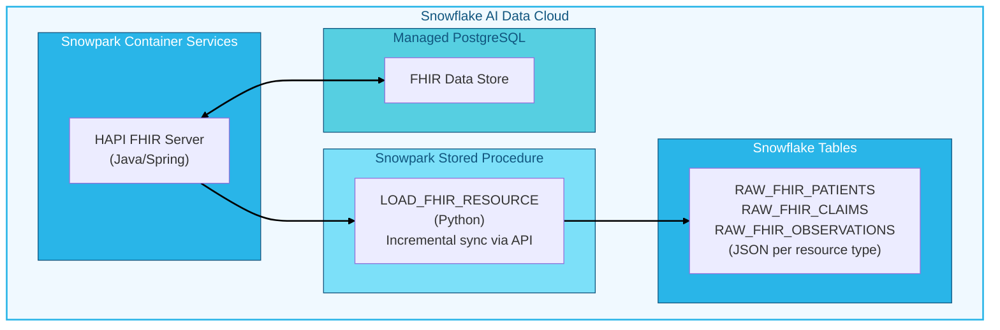

author: Christen Marshall
id: deploy-fhir-server-on-snowflake
categories: snowflake-site:taxonomy/solution-center/certification/quickstart,snowflake-site:taxonomy/product/data-engineering,snowflake-site:taxonomy/snowflake-feature/snowpark-container-services,snowflake-site:taxonomy/industry/healthcare-and-life-sciences
language: en
summary: Deploy a FHIR R4 server on Snowflake with automated data extraction for healthcare analytics.
environments: web
status: Published
feedback link: https://github.com/Snowflake-Labs/sfguides/issues

# Deploy a FHIR R4 Server on Snowflake for Healthcare Analytics
<!-- ------------------------ -->
## Overview

This solution provides an end-to-end **FHIR healthcare data platform** on Snowflake that deploys a HAPI FHIR JPA Server in Snowpark Container Services (SPCS), persists clinical data in Snowflake Managed PostgreSQL, extracts FHIR resources into Snowflake tables via automated ETL, and enables healthcare analytics on Patient, Claim, Observation, and other FHIR resources.

Healthcare organizations struggle to leverage clinical data trapped in EHR systems for analytics. FHIR APIs return complex nested JSON structures, data must be flattened for SQL-based analytics tools, incremental sync requires careful watermark tracking, and compliance demands data residency within the organization's cloud. This solution **automates the entire pipeline** from FHIR server deployment to analytics-ready tables.

### What You'll Learn
- How to deploy a production FHIR R4 server on Snowpark Container Services
- How to configure Snowflake Managed PostgreSQL for FHIR data persistence
- How to build an automated ETL pipeline using Snowpark stored procedures
- How to query FHIR data with standard SQL for healthcare analytics
- How to integrate MCP endpoints for AI agent capabilities

### What You'll Build
A complete FHIR healthcare data platform including:
- A HAPI FHIR JPA Server running in SPCS with persistent storage
- Automated ETL syncing clinical data incrementally to Snowflake tables
- SQL-queryable FHIR data for analytics and reporting
- AI-ready platform with MCP endpoints for agents

  

### Key Features

#### Production FHIR R4 Server
The HAPI FHIR JPA Server provides a complete, standards-compliant FHIR R4 implementation:
- Full HAPI FHIR JPA implementation with REST API
- Supports all FHIR R4 resource types (Patient, Claim, Observation, etc.)
- Built-in FHIR operations ($validate, $everything, $export)
- Web-based testing UI at `/`
- Swagger API documentation at `/fhir`

#### Snowflake-Native Persistence
All data remains within your Snowflake account, satisfying data residency and compliance requirements:
- Snowflake Managed PostgreSQL for durable storage
- Automatic schema creation via Hibernate
- Internal SPCS networking (no external dependencies)
- Secrets management for credentials

#### Automated ETL Pipeline
The ETL pipeline transforms FHIR data into analytics-ready Snowflake tables:
- Incremental sync using `_lastUpdated` watermarks
- Pagination support for large result sets
- Stored procedure callable from Snowflake Tasks
- Event table integration for observability

#### AI Agent Integration (MCP)
The platform is ready for AI-powered clinical applications:
- Model Context Protocol endpoints for AI agents
- CDS Hooks support for clinical decision support
- Ready for Snowflake Intelligence integration

### Prerequisites
- Access to a [Snowflake account](https://signup.snowflake.com/?utm_source=snowflake-devrel&utm_medium=developer-guides&utm_cta=developer-guides)
- ACCOUNTADMIN access to your Snowflake account
- Snowpark Container Services enabled
- Snowflake Managed PostgreSQL available
- Docker installed locally
- [Snowflake CLI (`snow`)](https://docs.snowflake.com/en/developer-guide/snowflake-cli/index) installed and configured

<!-- ------------------------ -->
## Architecture

The solution architecture leverages Snowflake's AI Data Cloud. The HAPI FHIR Server runs in SPCS and persists data to Snowflake Managed PostgreSQL. A Snowpark stored procedure extracts FHIR resources via the REST API and loads them into Snowflake tables for analytics.



| Component | Technology | Purpose |
|-----------|------------|---------|
| **FHIR Server** | HAPI FHIR JPA | Production-grade FHIR R4 implementation |
| **Compute** | Snowpark Container Services | Managed container runtime |
| **Database** | Snowflake Managed PostgreSQL | Persistent FHIR storage |
| **ETL** | Python / Snowpark | Incremental data extraction |
| **Analytics** | Snowflake SQL | Query FHIR data with standard SQL |
| **AI Integration** | MCP / Cortex | AI agent and analytics capabilities |

<!-- ------------------------ -->
## Clone and Build

The first step is to clone the repository and build a Docker image containing the HAPI FHIR JPA Server. This image packages a production-ready FHIR R4 server with all dependencies, configured for deployment on Snowpark Container Services.

The build script compiles the Java application, runs tests, and creates an optimized container image. Building locally allows you to customize the server configuration before deployment.

```bash
git clone <repository-url>
cd fhir-on-snowflake

./build-docker-image.sh
```

<!-- ------------------------ -->
## Push to Registry

Snowpark Container Services requires container images to be stored in Snowflake's private image registry. This ensures images are securely stored within your Snowflake account and accessible only to authorized services.

Pushing to the Snowflake registry involves three steps: obtaining your account-specific registry URL, authenticating Docker with your Snowflake credentials, and uploading the tagged image.

### Get Registry URL

Each Snowflake account has a unique registry URL. This command retrieves yours:

```bash
snow spcs image-registry url
```

### Authenticate Docker

Authenticate your local Docker client with the Snowflake registry. This uses your Snowflake CLI credentials to generate temporary registry access tokens.

```bash
snow spcs image-registry login
```

### Tag and Push Image

Tag your local image with the full registry path, then push it. The path format is `<org>-<account>.registry.snowflakecomputing.com/<database>/<schema>/<repository>/<image>:<tag>`.

```bash
docker tag hapi-fhir/hapi-fhir-jpaserver-starter:latest \
  <org>-<account>.registry.snowflakecomputing.com/<db>/<schema>/<repo>/hapi-fhir:latest

docker push <org>-<account>.registry.snowflakecomputing.com/<db>/<schema>/<repo>/hapi-fhir:latest
```

> For detailed image registry setup, see [SPCS Image Registry Documentation](https://docs.snowflake.com/en/developer-guide/snowpark-container-services/working-with-registry-repository).

<!-- ------------------------ -->
## Configure PostgreSQL

Before deploying the SPCS service, you must configure Snowflake Managed PostgreSQL with a dedicated user, database, and schema for the FHIR server. The HAPI FHIR JPA Server uses Hibernate ORM to automatically create and manage database tables on startup. For this auto-schema generation to work, the database user must have full DDL privileges (CREATE, ALTER, DROP) on both the database and schema.

### Why This Matters

HAPI FHIR creates approximately 200+ tables to store FHIR resources, search indexes, and operational data. Rather than manually creating this complex schema, Hibernate generates it automatically based on the JPA entity definitions. This requires:

- A dedicated database to isolate FHIR data from other workloads
- A dedicated schema to organize tables logically
- A user with ownership or full privileges to create/modify tables

### Create the FHIR User

Create a dedicated PostgreSQL user for the FHIR server. This user will own all FHIR-related objects and should not be shared with other applications.

```sql
CREATE USER fhir_user WITH PASSWORD '<strong-password>';
```

> IMPORTANT: Use a strong, unique password. You will store this in a Snowflake secret in the next section.

### Create the Database

Create a dedicated database for FHIR data. This isolates healthcare data from other workloads and simplifies backup, security, and access control.

```sql
CREATE DATABASE fhir_db OWNER fhir_user;
```

Setting `fhir_user` as the owner grants full control over the database, including the ability to create schemas and tables.

### Create the Schema

Connect to the new database and create a schema for FHIR tables. Using a dedicated schema (rather than `public`) provides better organization and security boundaries.

```sql
\c fhir_db

CREATE SCHEMA fhir_schema AUTHORIZATION fhir_user;
```

The `AUTHORIZATION fhir_user` clause makes `fhir_user` the schema owner, granting full DDL privileges.

### Grant Additional Privileges

Ensure the user has all necessary privileges for Hibernate's auto-schema generation:

```sql
GRANT ALL PRIVILEGES ON DATABASE fhir_db TO fhir_user;

GRANT ALL PRIVILEGES ON SCHEMA fhir_schema TO fhir_user;

ALTER DEFAULT PRIVILEGES IN SCHEMA fhir_schema 
  GRANT ALL PRIVILEGES ON TABLES TO fhir_user;

ALTER DEFAULT PRIVILEGES IN SCHEMA fhir_schema 
  GRANT ALL PRIVILEGES ON SEQUENCES TO fhir_user;
```

These grants ensure that:
- The user can create new tables and sequences as Hibernate requires
- Any future objects created in the schema inherit the correct privileges
- The FHIR server can perform all CRUD operations on its data

### Verify the Configuration

Confirm the setup by connecting as the FHIR user and checking privileges:

```sql
\c fhir_db fhir_user

\dn+ fhir_schema
```

You should see `fhir_user` listed as the owner with full privileges on `fhir_schema`.

<!-- ------------------------ -->
## Deploy SPCS Service

With the image in your registry and PostgreSQL configured, you can now deploy the FHIR server as an SPCS service. The service specification defines compute resources, networking, environment variables, and secrets.

SPCS manages container lifecycle, auto-restarts on failure, and provides internal DNS for service-to-service communication within your Snowflake account.

### Configure Environment Variables

The FHIR server requires environment variables to connect to PostgreSQL. Update `spcs-service-spec.yaml` with your configuration:

| Variable | Required | Description |
|----------|----------|-------------|
| `SPRING_DATASOURCE_URL` | Yes | JDBC URL to your Snowflake Managed PostgreSQL |
| `HAPI_FHIR_TESTER_HOME_SERVER_ADDRESS` | No | Internal URL for the test UI (set after service is created) |

### Create Database Secret

Never hardcode passwords in service specifications. Instead, use Snowflake secrets to securely store and inject credentials at runtime. The secret is encrypted at rest and only accessible to services you explicitly grant access to.

```sql
CREATE SECRET <db>.<schema>.fhir_db_password
  TYPE = GENERIC_STRING
  SECRET_STRING = '<your-password>';
```

### Configure Secret Reference

Reference the secret in your service specification. SPCS injects the secret value as an environment variable when the container starts, keeping credentials out of logs and configuration files.

Reference the secret in `spcs-service-spec.yaml`:

```yaml
secrets:
- snowflakeSecret:
    objectName: <db>.<schema>.fhir_db_password
  secretKeyRef: secret_string
  envVarName: SPRING_DATASOURCE_PASSWORD
```

Create the service in Snowsight or via SQL. Once running, the FHIR server will automatically connect to PostgreSQL and create all required tables via Hibernate.

<!-- ------------------------ -->
## Deploy ETL Pipeline

The ETL pipeline extracts FHIR resources from the server and loads them into Snowflake tables for analytics. It's implemented as a Snowpark Python stored procedure that can be called on-demand or scheduled via Snowflake Tasks.

The pipeline uses incremental sync with `_lastUpdated` watermarks, meaning it only fetches resources modified since the last run. This minimizes API calls and load times for ongoing synchronization.

### Setup Database Objects

The setup script creates the database, schema, and required tables for tracking sync state:

```bash
cd snowflake-etl

snow sql -f Setup.sql
```

### Build and Deploy

Snowpark build compiles the Python code and packages dependencies. Deploy uploads the package to Snowflake and registers the stored procedure.

```bash
snow snowpark build

snow snowpark deploy
```

### Update Existing Deployment

To update an existing deployment with code changes, use the `--replace` flag:

```bash
snow snowpark deploy --replace
```

<!-- ------------------------ -->
## Load Test Data

Before running analytics queries, you need data in your FHIR server. The HL7 organization publishes [fhir.test.data.r4](https://www.fhir.org/packages/fhir.test.data.r4/), a standardized test dataset containing realistic Patient, Observation, Condition, and other resources.

This step is optional for production deployments where you'll load real clinical data, but essential for development and testing.

### Setup Python Environment

The data loader requires Python dependencies. Use conda to create an isolated environment with all required packages:

```bash
cd snowflake-etl

conda env create -f environment.local.yml
conda activate fhir-on-snowflake
```

### Load to Local Server

For local development, load data to your localhost FHIR server:

```bash
python load_test_data/load_fhir_test_data.py --server-url http://localhost:8080/fhir
```

### Load to SPCS Endpoint

For the deployed SPCS service, specify the public endpoint and a Snowflake connection with a Personal Access Token (PAT) for authentication:

```bash
python load_test_data/load_fhir_test_data.py \
  --server-url https://<endpoint>.snowflakecomputing.app/fhir \
  --connection my-connection
```

### Persist Downloaded Data

To avoid re-downloading the test data package on subsequent runs, save it locally with `--data-dir`. Use `--skip-download` to load from the cached data:

```bash
python load_test_data/load_fhir_test_data.py \
  --server-url http://localhost:8080/fhir \
  --data-dir ./fhir_data --skip-download
```

<!-- ------------------------ -->
## Load FHIR Resources

With data in your FHIR server, use the ETL stored procedure to extract resources into Snowflake tables. Each FHIR resource type (Patient, Claim, Observation, etc.) is loaded into its own table with the full JSON document stored in a VARIANT column.

The procedure handles pagination automatically, fetching resources in batches until all matching records are retrieved. It also tracks sync watermarks so subsequent calls only fetch new or updated resources.

### Procedure Signature

The procedure accepts four parameters, all with sensible defaults:

```sql
LOAD_FHIR_RESOURCE(
    resource_type STRING DEFAULT 'Claim',
    target_table STRING DEFAULT 'RAW_FHIR_RESOURCES',
    event_table STRING DEFAULT 'SNOWFLAKE.TELEMETRY.EVENTS',
    fhir_base_url STRING DEFAULT 'http://<service>.<pool>.svc.spcs.internal:8080/fhir'
)
RETURNS STRING
```

### Load Resources

Call the procedure for each resource type you want to analyze. Each call creates the target table if it doesn't exist and appends new resources:

```sql
CALL HL7.RAW.LOAD_FHIR_RESOURCE('Patient', 'RAW_FHIR_PATIENTS');

CALL HL7.RAW.LOAD_FHIR_RESOURCE('Claim', 'RAW_FHIR_CLAIMS');

CALL HL7.RAW.LOAD_FHIR_RESOURCE('Observation', 'RAW_FHIR_OBSERVATIONS');
```

### Return Value Example

The procedure returns a JSON object with sync statistics and a query to retrieve detailed event logs:

```json
{
  "status": "success",
  "count": 150,
  "run_id": "abc-123-def",
  "session_id": "12345678",
  "events_query": "SELECT * FROM SNOWFLAKE.TELEMETRY.EVENTS WHERE ...",
  "message": "Loaded 150 Patient resources into RAW_FHIR_PATIENTS"
}
```

### Tracking Tables

The procedure automatically creates these tables on first run to support incremental sync and auditing:

- `HL7.RAW.FHIR_SYNC_WATERMARKS` - Stores the `_lastUpdated` timestamp per resource type. Subsequent syncs use this as a starting point to fetch only new/modified resources.
- `HL7.RAW.FHIR_SYNC_HISTORY` - Audit log of all sync runs including resource counts, duration, and status. Useful for monitoring and troubleshooting.

<!-- ------------------------ -->
## Query Your Data

FHIR resources are stored as JSON documents in Snowflake VARIANT columns. Snowflake's semi-structured data features let you query nested JSON using familiar SQL syntax with colon notation for path traversal.

These examples demonstrate common healthcare analytics patterns. The `:` operator navigates JSON paths, `::` casts to specific types, and array indexing `[0]` accesses list elements.

### Basic Patient Query

Extract core patient demographics from the FHIR Patient resource structure:

```sql
SELECT 
  RESOURCE:id::STRING AS patient_id,
  RESOURCE:name[0]:family::STRING AS last_name,
  RESOURCE:birthDate::DATE AS birth_date
FROM RAW_FHIR_PATIENTS;
```

### Claims Analysis

Aggregate claims by type for revenue cycle analytics. FHIR uses CodeableConcept structures with nested coding arrays:

```sql
SELECT 
  RESOURCE:type:coding[0]:code::STRING AS claim_type,
  COUNT(*) AS claim_count
FROM RAW_FHIR_CLAIMS
GROUP BY 1;
```

### Clinical Research

Join patients with conditions to identify cohorts for clinical trials. This example finds patients with Type 2 Diabetes (ICD-10 code E11):

```sql
SELECT RESOURCE:id::STRING AS patient_id
FROM RAW_FHIR_PATIENTS p
JOIN RAW_FHIR_CONDITIONS c ON c.RESOURCE:subject:reference::STRING = 'Patient/' || p.RESOURCE:id::STRING
WHERE c.RESOURCE:code:coding[0]:code::STRING = 'E11';
```

### Population Health

Identify high-risk patients by counting distinct conditions. Patients with 5+ conditions may benefit from care management programs:

```sql
SELECT 
  p.RESOURCE:id::STRING AS patient_id,
  COUNT(DISTINCT c.RESOURCE:code:coding[0]:code) AS condition_count
FROM RAW_FHIR_PATIENTS p
JOIN RAW_FHIR_CONDITIONS c ON c.RESOURCE:subject:reference LIKE '%' || p.RESOURCE:id::STRING
GROUP BY 1
HAVING condition_count >= 5;
```

### Revenue Cycle

Analyze claims volume and billing amounts by payer for financial reporting:

```sql
SELECT 
  RESOURCE:insurer:display::STRING AS payer,
  SUM(RESOURCE:total:value::NUMBER) AS total_billed
FROM RAW_FHIR_CLAIMS
GROUP BY 1
ORDER BY 2 DESC;
```

<!-- ------------------------ -->
## Local Development

For faster iteration during development, run the FHIR server locally before deploying to SPCS. Two options are available depending on whether you need to test against the actual Snowflake Managed PostgreSQL or prefer a fully self-contained environment.

### Option A: Local PostgreSQL

This option starts both the FHIR server and a PostgreSQL container locally. Use this for initial development when you don't need to test Snowflake connectivity:

```bash
docker-compose -f docker-compose-localpostgres.yml up -d --build

open http://localhost:8080/fhir
```

### Option B: External PostgreSQL

This option connects your local FHIR server to Snowflake Managed PostgreSQL. Use this to test the exact database configuration you'll use in production:

```bash
export SPRING_DATASOURCE_URL="jdbc:postgresql://<host>:5432/fhir?sslmode=require&currentSchema=fhir_schema"
export FHIR_DB_PASSWORD="<your-password>"

docker-compose up -d --build

open http://localhost:8080/fhir
```

### Run with Maven

For Java development, run directly with Maven for hot-reload capabilities. The `-Pboot` profile configures Spring Boot settings:

```bash
mvn spring-boot:run -Pboot
```

To build a standalone WAR file for deployment testing:

```bash
mvn clean package spring-boot:repackage -Pboot
java -jar target/ROOT.war
```

### Run Tests

Execute the test suite before committing changes. Unit tests run quickly with H2 in-memory database; integration tests verify full functionality:

```bash
mvn test

mvn verify
```

<!-- ------------------------ -->
## CLI Usage

The CLI provides a local interface to the ETL pipeline for development and testing. It uses the same code as the Snowpark stored procedure but runs on your machine, making it easier to debug and iterate.

Use the CLI to test against external FHIR servers or validate your ETL logic before deploying to Snowflake.

### Setup Environment

Create the conda environment with all required dependencies:

```bash
cd snowflake-etl

conda env create -f environment.local.yml
conda activate fhir-on-snowflake
```

### CLI Options

The CLI mirrors the stored procedure parameters with command-line flags:

| Option | Required | Default | Description |
|--------|----------|---------|-------------|
| `--fhir-url` | **Yes** | - | FHIR server base URL |
| `--connection` | No | `default` | Snowflake connection name |
| `--event-table` | No | `SNOWFLAKE.TELEMETRY.EVENTS` | Event table for log correlation |

### Examples

Load resources from various FHIR endpoints:

```bash
python cli.py Patient RAW_FHIR_PATIENTS --fhir-url https://hapi.fhir.org/baseR4

python cli.py Patient RAW_FHIR_PATIENTS --fhir-url https://hapi.fhir.org/baseR4 --connection my-prod-connection

python cli.py Observation RAW_FHIR_OBS \
  --fhir-url https://<your-fhir-endpoint>/fhir \
  --connection my-connection \
  --event-table MY_DB.LOGS.EVENTS
```

<!-- ------------------------ -->
## Repository Structure

The repository is organized into logical components:

```
fhir-on-snowflake/
├── README.md
├── FUTURE_ENHANCEMENTS.md
├── AGENTS.md
│
├── src/
│   ├── main/java/
│   ├── main/resources/
│   └── test/
│
├── Dockerfile
├── build-docker-image.sh
├── spcs-service-spec.yaml
├── docker-compose.yml
│
├── snowflake-etl/
│   ├── load_fhir_resource/
│   │   ├── app.py
│   │   └── flat_view.py
│   ├── load_test_data/
│   ├── cli.py
│   ├── Setup.sql
│   ├── snowflake.yml
│   └── environment.local.yml
│
└── charts/
```

<!-- ------------------------ -->
## Production Considerations

This project demonstrates FHIR server deployment on Snowflake. Before using in production with real patient data, address these security and scalability concerns.

The project is based on the [HAPI FHIR JPA Server Starter](https://github.com/hapifhir/hapi-fhir-jpaserver-starter). The following features are **not included** and must be implemented:

1. **No security implementation** - You must implement authentication/authorization. See [Security Documentation](https://hapifhir.io/hapi-fhir/docs/security/introduction.html)

2. **No enterprise logging** - Audit logging must be configured. See [BALP Interceptor](https://hapifhir.io/hapi-fhir/docs/security/balp_interceptor.html)

3. **In-memory subscription topic cache** - The default implementation is not shared across multiple instances

4. **In-memory message broker** - The default channel implementation is not shared across instances

<!-- ------------------------ -->
## Conclusion And Resources

Congratulations! You've successfully deployed a FHIR R4 server on Snowflake with automated data extraction for healthcare analytics. You now have a complete platform for clinical research, population health management, revenue cycle analytics, and AI-powered clinical decision support.

### What You Learned
- How to deploy a HAPI FHIR JPA Server on Snowpark Container Services
- How to configure Snowflake Managed PostgreSQL for persistent FHIR storage
- How to build and deploy an incremental ETL pipeline using Snowpark
- How to query FHIR data using standard SQL for healthcare analytics
- How to set up local development environments for testing

### Related Resources

Documentation:
- [SPCS Documentation](https://docs.snowflake.com/en/developer-guide/snowpark-container-services/overview)
- [SPCS Image Registry](https://docs.snowflake.com/en/developer-guide/snowpark-container-services/working-with-registry-repository)
- [Managed PostgreSQL](https://docs.snowflake.com/en/user-guide/snowflake-postgres/about)
- [Snowpark Python](https://docs.snowflake.com/en/developer-guide/snowpark/python/index)
- [Snowflake CLI](https://docs.snowflake.com/en/developer-guide/snowflake-cli/index)
- [HAPI FHIR Docs](https://hapifhir.io/hapi-fhir/docs/)

Additional Reading:
- [FUTURE_ENHANCEMENTS.md](./FUTURE_ENHANCEMENTS.md) - Roadmap for SMART on FHIR, Epic integration
- [AGENTS.md](./AGENTS.md) - Guidelines for AI coding assistants
- [HAPI FHIR Wiki](https://github.com/hapifhir/hapi-fhir/wiki/Getting-Help)
